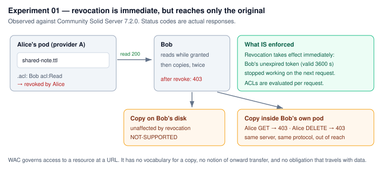
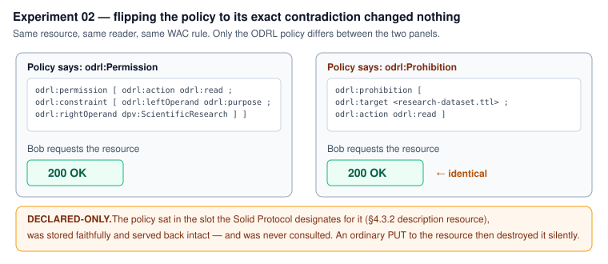
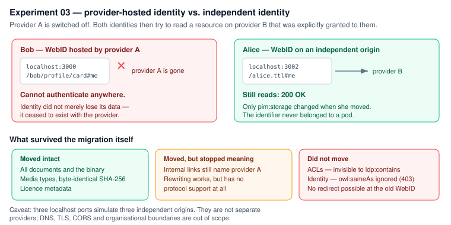

# Solid Thesis Lab — portability and consent under EU law

A local, reproducible Solid laboratory for a Master's thesis at HSG
(Prof. Simon Mayer; Prof. Aurelia Tamò-Larrieux, Law). It runs small
experiments against a real Solid server to answer one question:

> **What does the protocol actually ENFORCE, versus what is merely DECLARED?**

**→ [`RESULTS.md`](RESULTS.md) has the findings.** Start there.

## Quick start

Requires Node 18+, [`uv`](https://docs.astral.sh/uv/), and git.

```bash
./start.sh --reset     # wipe storage, start 3 servers, provision users
uv run pytest -q       # re-verify every claim in RESULTS.md
```

Then read any experiment, or run one directly:

```bash
uv run python experiments/02_odrl_consent/run.py
```

`./start.sh` (no flag) resumes an existing lab; `./start.sh --stop` stops it.

## The experiments

| | Question | Headline result |
|---|---|---|
| [`00_hello_pod`](experiments/00_hello_pod/) | Is Web Access Control actually enforced? | Yes — and a new pod's root container is world-readable by default |
| [`01_share_revoke`](experiments/01_share_revoke/) | What does withdrawal reach? | Revocation is immediate; copies are permanently out of reach, even in the recipient's own pod |
| [`02_odrl_consent`](experiments/02_odrl_consent/) | Is an ODRL/DPV consent policy enforced? | No. Flipping it to a prohibition changed nothing — and an ordinary data update destroys it |
| [`03_portability`](experiments/03_portability/) | What survives a move between providers? | The bytes. Not the links, not the permissions, and not the identity |

Each experiment folder contains its pre-registered hypotheses and its result in
the same README, plus raw HTTP transcripts under `evidence/`.

## Figures





## How results are classified

| Term | Meaning |
|---|---|
| **ENFORCED** | The server changed its behaviour because of it |
| **ADVERTISED** | The server states permissions it genuinely applies (`WAC-Allow`) |
| **DECLARED-ONLY** | Present as metadata, with no effect on any decision |
| **NOT-SUPPORTED** | No mechanism exists at all |
| **UNEXPECTED** | A pre-registered expectation did not hold |

Every check declares its expected outcome **before** running. Each experiment's
hypotheses are committed in a separate, earlier commit than its results, so the
git history shows they were not retrofitted.

## Method notes

- All personal data is **fictional**; the binary fixture is generated, not
  downloaded.
- Three `localhost` ports **simulate** three independent origins — they are not
  separate providers.
- `RESULTS.md` draws **no legal conclusions**; it records observations and the
  provisions they bear on, as open questions.
- Versions are pinned (CSS 7.2.0, Python 3.12, lockfiles committed).

## Repository layout

```
solidlib/     client library: auth (DPoP), provisioning, WAC, description
              resources, evidence logging, the four-state check model
experiments/  one folder per experiment
figures/      SVG figures drawn from observed results
prompts/      every instruction given, verbatim, with outcomes (AI-use record)
```

`.env`, `data/`, `data2/`, `webid/` and `logs/` are generated and never
committed.
